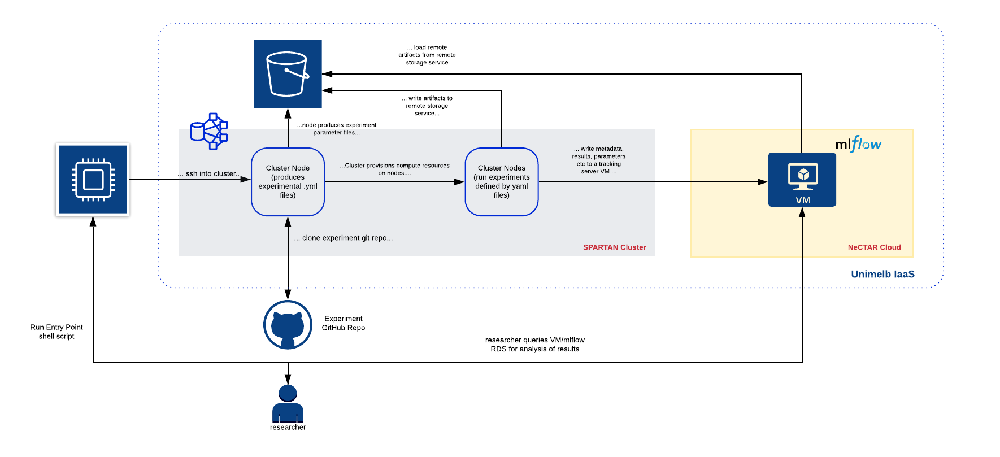

# EZ-EXPERIMENTr

*Running reproducible research experiments at scale*

EZ-EXPERIMENTr is a toolkit under-development with the aim to help researchers run automated experiments on a cluster. 

- The tool is designed to dispatch many experiments as reproducible singularity containers to run on a specified cluster. 
- The first iteration of this toolkit will be using the University of Melbourne IaaS (that's where I am doing my PhD)
- The DockerFile in this repo is to setup an instance of `mlflow`. It currently doesn't support using a database service.

To run the mlflow container use the following commands:

```shell
docker build -t ez-experimentr/mlflow .
docker run -p 5000:5000 ez-experimentr/mlflow
```

To run experiments:

```shell
# Run entry_point.sh
bash bin/entry_point.sh
```

## Proposed Architecture
<a href="https://github.com/vivekkatial/ez-experimentr/blob/master/cluster-experimentation-workflow.png">
    
</a>

## Who should use EZ-EXPERIMENTr?
- Researchers trying to scale up their experiments
- Data Scientists/ML Engineers who are looking to run many experiments at scale

## Developers
- Vivek Katial
