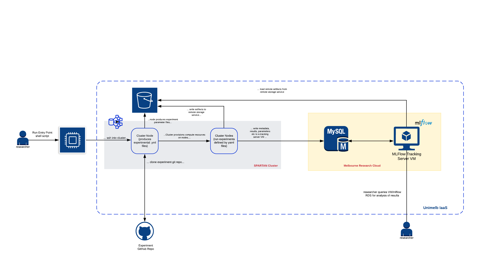

# EZ-EXPERIMENTr

*Running reproducible research experiments at scale*

EZ-EXPERIMENTr is a toolkit under-development with the aim to help researchers run automated experiments on a cluster. 

- The tool is designed to dispatch many experiments as individual jobs to run on a specified cluster. 
- The first iteration of this toolkit will be using the University of Melbourne IaaS (that's where I am doing my PhD).

## Proposed Architecture

## Who should use EZ-EXPERIMENTr?
- Researchers trying to scale up their experiments
- Data Scientists/ML Engineers who are looking to run many experiments at scale

## Developers
- Vivek Katial
- Aman Mehta
