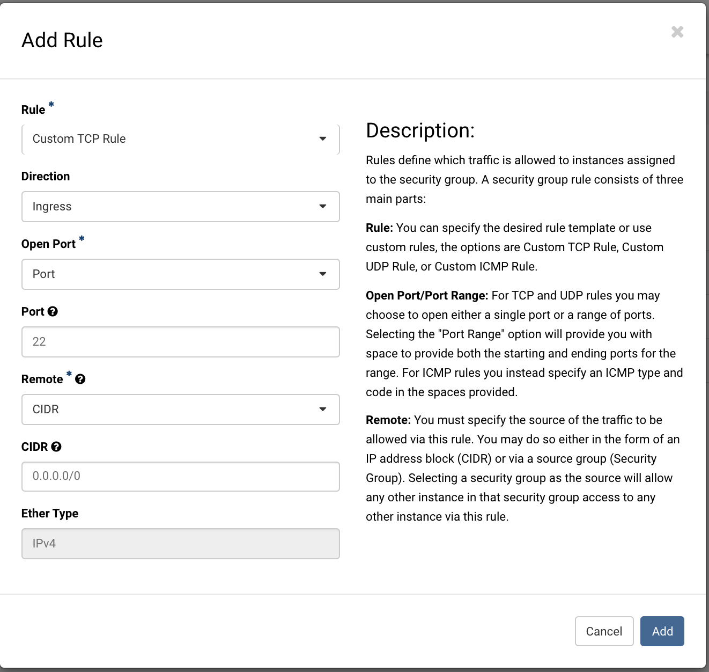
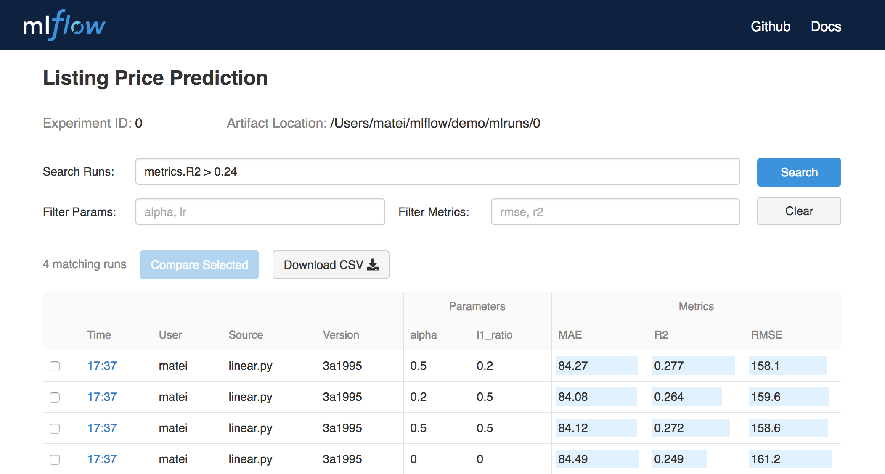

# EZ-EXPERIMENTR Setup Instructions

## Table of Contents

- [Introductions](#introduction)
- [Getting access to SPARTAN](#getting-access-to-spartan)
- [Initialising MRC](#initialising-mrc-instance)
- [Install Singularity](#install-singularity)
- [Request Object Storage](#request-object-store)

## Introduction

This document outlines what infrastructure to provision for setting up `EZ-experimentr` and we also outline *how* to provision this infrastructure on the University of Melbourne's IaaS.

## Getting access to SPARTAN

### Overview

Spartan is High Performance Computing (HPC) system operated by Research Platform Services (ResPlat) at The University of Melbourne. We will be utilising this HPC cluster to run our experiments.

Why?
- Computing takes too long!
- Lack of memory and speed

To get access SPARTAN follow the instructions [here](https://dashboard.hpc.unimelb.edu.au/getting_started/)

### Setting up automatic SSH

Once you have been granted access to SPARTAN, you must setup "password-less" `ssh` from your local machine. Why? Because, a passwordless SSH for Spartan will make your life easier. You won't even need to remember your password and you'll be able to run `bash` scripts that connect directly to Spartan.

Below I have taken a snippet from the [Spartan FAQ Docs](https://dashboard.hpc.unimelb.edu.au/faq/) which explains how to do this for UNIX systems. 

```
$ ssh-keygen -t rsa
Generating public/private rsa key pair.
Enter file in which to save the key (/home/user/.ssh/id_rsa): 
Created directory '/home/user/.ssh'.
Enter passphrase (empty for no passphrase): 
Enter same passphrase again: 
Your identification has been saved in /home/user/.ssh/id_rsa.
Your public key has been saved in /home/user/.ssh/id_rsa.pub
The key fingerprint is:
43:51:43:a1:b5:fc:8b:b7:0a:3a:a9:b1:0f:66:73:a8 user@localhost
```

Now append the new public key to `~/.ssh/authorized_keys` on Spartan (you'll be asked for your password one last time). Run the following command:

```
$ cat .ssh/id_rsa.pub | ssh <YOUR_USERNAME>@spartan.hpc.unimelb.edu.au 'cat >> .ssh/authorized_keys'
```

Depending on your version of SSH you might also have to do the following changes:

Put the public key in `.ssh/authorized_keys2`
Change the permissions of `.ssh` to 700 (use `chmod`)
Change the permissions of `.ssh/` authorized_keys2 to 640 (use `chmod`)

## Initialising MRC Instance

Here we will be initialising a Virtual Machine (VM) on the Melbourne Research Cloud which will build the container image to run your experiment.

1. Gain access to Melbourne Research Cloud (MRC) by requesting an account with MRC. Check out this link to set up an account [here](https://research.unimelb.edu.au/infrastructure/research-computing-services/services/research-cloud).

### Provisioning Instances

Once you have set up an account on MRC you will be able to provision VMs to run on the MRC. For an introduction on how to set up your first instance check out the guide [here](https://docs.cloud.unimelb.edu.au/training/first_instance/).


1. Provision a VM Instances with the name `YOUR_EXP_NAME_VM`. This VM will use Singularity to build your container file that encapsulates the experiment
	- Use the following source when provisioning an instance `NeCTAR Ubuntu 18.04 LTS (Bionic) amd64 (with Docker)`
	- Use the following flavour when provisioning an instance: `uom.general.1c4g`
	- Download your `.pem` key file and store it in ~/.ssh/ (if your machine does not have a `~/.ssh` directory create one)
	- **CAUTION: This security key MUST not be shared with anyone or over the web (please use `scp` to move it)**
  - If your `.pem` file permissions are too wide open, ensure you change the permission access. To do this you can use the following bash command
    - `$ chmod 400 ~/.ssh/<YOUR_KEY_FILE>.pem`
2. Once you have provisioned the instance, you may need to enable `ssh` access:
	- Start off by creating a security group (Go on Network > Security Groups)
	- Name your new security group `SSH`
	- Plug in the following settings
	- 
  - **Now you must add the security group onto your instance**. To do this you, right click "Actions" on the instance and select "Edit Security Groups"
3. Once you have provisioned the instance on MRC and set up your security groups you can `ssh` into your instance:
	- If you're on Mac OSX or Linux simply use `ssh  -i ~/.ssh/<YOUR_KEY_FILE>.pem ubuntu@<INSTANCE_IP_ADDRESS>`
	- On Windows, follow the instructions [here](https://support.ehelp.edu.au/support/solutions/articles/6000055446-accessing-instances)

You can verify you're in the instance by running `who`

## Install Singularity

We will now outline the basic steps for installing *Singularity* on your VM. First start of by logging into your VM:

```
$ ssh  -i ~/.ssh/<YOUR_KEY_FILE>.pem ubuntu@<INSTANCE_IP_ADDRESS>
```

For full instructions on installation, check out the [installation guide](https://sylabs.io/guides/3.5/admin-guide/installation.html).

### Install system dependencies

You must first install development tools and libraries to your host:

```
$ sudo apt-get update && \
  sudo apt-get install -y build-essential \
  libseccomp-dev \
  pkg-config \
  squashfs-tools \
  cryptsetup \
  libssl-dev \
  uuid-dev
```

### Install Golang

This is one of several ways to [install and configure golang](https://golang.org/doc/install).

First, download the Golang archive to `/tmp`, then extract the archive to `/usr/local`.

_**NOTE:** if you are updating Go from a older version, make sure you remove `/usr/local/go` before
reinstalling it._

```
$ export VERSION=1.13.5 OS=linux ARCH=amd64  # change this as you need

$ wget -O /tmp/go${VERSION}.${OS}-${ARCH}.tar.gz https://dl.google.com/go/go${VERSION}.${OS}-${ARCH}.tar.gz && \
  sudo tar -C /usr/local -xzf /tmp/go${VERSION}.${OS}-${ARCH}.tar.gz
```

Finally, set up your environment for Go:

```
$ echo 'export GOPATH=${HOME}/go' >> ~/.bashrc && \
  echo 'export PATH=/usr/local/go/bin:${PATH}:${GOPATH}/bin' >> ~/.bashrc && \
  source ~/.bashrc
```

### Install golangci-lint

This is an optional (but highly recommended!) step. To ensure
consistency and to catch certain kinds of issues early, we provide a
configuration file for golangci-lint. Every pull request must pass the
checks specified there, and these will be run automatically before
attempting to merge the code. If you are modifying Singularity and
contributing your changes to the repository, it's faster to run these
checks locally before uploading your pull request.

In order to install golangci-lint, you can run:

```
$ curl -sfL https://install.goreleaser.com/github.com/golangci/golangci-lint.sh |
  sh -s -- -b $(go env GOPATH)/bin v1.15.0
```

This will download and install golangci-lint from its Github releases
page (using version v1.15.0 at the moment).

### Clone the repo

Golang is a bit finicky about where things are placed. Here is the correct way
to build Singularity from source:

```
$ mkdir -p ${GOPATH}/src/github.com/sylabs && \
  cd ${GOPATH}/src/github.com/sylabs && \
  git clone https://github.com/sylabs/singularity.git && \
  cd singularity
```

To build a stable version of Singularity, check out a [release tag](https://github.com/sylabs/singularity/tags) before compiling:

```
$ git checkout v3.5.1
```

### Compiling Singularity

You can build Singularity using the following commands:

```
$ cd ${GOPATH}/src/github.com/sylabs/singularity && \
  ./mconfig && \
  cd ./builddir && \
  make && \
  sudo make install &&
  cd ~
```

And that's it! Now you can check your Singularity version by running:

```
$ singularity version
```

## Request Object Storage

MRC has a secure, managed and highly scalable storage technologies can be used for performing data analysis with SPARTAN. To use `EZ-experimentr` you will need to request such storage. The type of storage you must request is `object storage`.

Please use the links below to request your research data storage:

- [UoM Staff](http://go.unimelb.edu.au/cmq6)
- [UoM Students](http://go.unimelb.edu.au/5exr)

Once you have access to this storage, you will be provided with the following credentials:

```
tenant: <TENANT>
username: <USERNAME>
access_key:<YOUR_ACCESS_KEY>
secret_key:<YOUR_SECRET_KEY>
```

For instruction on accessing the object storage gateway, please refer to the following wiki entry:
https://wiki.cloud.unimelb.edu.au/resplat/doku.php?id=rdsssupport:s3_object-storage

Once this is activated, you must now configure your `aws` credentials on SPARTAN.

1. SSH into SPARTAN
  - `$ ssh <USERNAME>@spartan.hpc.unimelb.edu.au`
2. Load the AWS module into SPARTAN
  - `$ module load awscli/1.16.67-GCC-6.2.0`
3. Configure AWS
  - `$ aws configure`
  - You will be prompted to fill in your access key and secret access key (provide the ones given to you)
4. Test that you're connected.
  - `$ aws s3 ls --endpoint-url=https://objects.storage.unimelb.edu.au`

## Provision MLFlow Instance

We will now provision another VM to run an [mlflow](https://mlflow.org/) server. This is similar to the process outlined [earlier](#initialising-mrc-instance). However, there will be slightly different settings we will use.

1. Provision a VM Instances with the name `mlflow-ez-experimentr`.
  - Use the following source when provisioning an instance `NeCTAR Ubuntu 18.04 LTS (Bionic) amd64 (with Docker)`
  - Use the following flavour when provisioning an instance: `uom.general.2c8g`
  - Download your `.pem` key file and store it in ~/.ssh/ (if your machine does not have a `~/.ssh` directory create one)
  - **CAUTION: This security key MUST not be shared with anyone or over the web (please use `scp` to move it)**
  - If your `.pem` file permissions are too wide open, ensure you change the permission access. To do this you can use the following bash command
    - `$ chmod 400 ~/.ssh/<YOUR_KEY_FILE>.pem`
2. Once you have provisioned the instance, you will need to enable `ssh` and `http` access as well:
  - You will already have `ssh` security group from [earlier](#initialising-mrc-instance)
  - To create the HTTP security group follow the same process
  - Name your new security group `HTTP`
  - However this time you must add **two** rules.
  - One for opening up port `80` and another for port `5000`
  - **Now you must add the security group onto your MLFlow instance**. To do this you, right click "Actions" on the instance and select "Edit Security Groups"
3. Once you have provisioned the instance on MRC and set up your security groups you can `ssh` into your instance:
  - If you're on Mac OSX or Linux simply use `ssh  -i ~/.ssh/<YOUR_KEY_FILE>.pem ubuntu@<INSTANCE_IP_ADDRESS>`
  - On Windows, follow the instructions [here](https://support.ehelp.edu.au/support/solutions/articles/6000055446-accessing-instances)
4. Once you have successfully `ssh`ed into the machine, clone the `ez-experimentr` repository:
  - `$ git clone https://github.com/vivekkatial/ez-experimentr.git`
5. You will also need to ensure that your `aws` credentials are present on the `VM`. To do this you must `scp` the credentials from your local machine onto the `VM`.
  - `$ scp -i ~/.ssh/<VM_PEM_KEY.pem> -r .aws/ ubuntu@<VM_URI>:ez-experimentr/`
6. Then `ssh` **back** into the VM and `cd` into the `ez-experimentr` directory and run the `build_mlflow_container.sh` shell script as `sudo`:
  - `$ sudo bash bin/build_mlflow_container.sh`
7. You should now have successfully built an `mlflow` Docker container. Verify this by running:
  - `$ sudo docker images`
8. You can now deploy the `mlflow` container by running:
  - `$ sudo bash bin/start_mlflow.sh`
9. Verify your instance is deployed by going on your internet browser and going too:
  - http://<YOUR_VM_IP_ADDRESS>:5000
  - You should see the `mlflow` UI:
  - 

**CAUTION:** It is a good idea to deploy this on a private network, or use a reverse proxy such as nGINX.

## Building Singularity Container on your VM Instance

1. Once you have you provisioned a VM and developed your `Singularity` container, you can build the container in your VM


## Integrating with SPARTAN

1. You must ensure that your `pem` file is also present in your SPARTAN home directory. 
2. Use `scp` to migrate the `pem` file from your local machine into `~/.ssh/` on Spartan. You can use the following `bash` command on your local machine.
  - `$ scp ~/.ssh/<YOUR_KEY_FILE>.pem <USERNAME>@spartan.hpc.unimelb.edu.au:.ssh/`
  - This step is to ensure that SPARTAN can access your VMs that are provisioned in the MRC
3. You must ensure that your `.aws` 

